# Life Dashboard

## Database ER diagram

The diagram reflects migrations `000001` through `000016`. JSON payloads,
embeddings, and some operational timestamps are omitted for readability.

```mermaid
erDiagram
    users {
        uuid id PK
        varchar username UK
        varchar password_hash
        varchar totp_secret
        boolean totp_enabled
        timestamptz created_at
        timestamptz last_active_at
    }

    sync_state {
        varchar source PK
        uuid user_id PK, FK
        timestamptz last_synced_at
        boolean enabled
        integer consecutive_failures
        timestamptz last_failed_at
    }

    oauth_tokens {
        varchar source PK
        uuid user_id PK, FK
        text access_token
        text refresh_token
        timestamptz expires_at
        bigint athlete_id
    }

    api_keys {
        uuid user_id PK, FK
        varchar key UK
        timestamptz created_at
    }

    raw_events {
        uuid id PK
        uuid user_id FK
        varchar source
        varchar event_type
        varchar external_id
        jsonb payload
        timestamptz ingested_at
    }

    workouts {
        uuid id PK
        uuid user_id FK
        varchar source
        varchar external_id
        varchar routine_external_id
        timestamptz started_at
        timestamptz ended_at
        varchar title
    }

    workout_sets {
        uuid id PK
        uuid workout_id FK
        varchar exercise_name
        varchar exercise_category
        integer set_index
        varchar set_type
        numeric weight_kg
        integer reps
        integer duration_seconds
        numeric rpe
    }

    workout_routines {
        uuid id PK
        uuid user_id FK
        varchar source
        varchar external_id
        varchar title
        bigint folder_id
        timestamptz source_created_at
        timestamptz source_updated_at
    }

    routine_exercises {
        uuid id PK
        uuid routine_id FK
        integer exercise_index
        varchar exercise_name
        varchar template_id
        varchar superset_id
        integer rest_seconds
    }

    routine_sets {
        uuid id PK
        uuid routine_exercise_id FK
        integer set_index
        varchar set_type
        numeric weight_kg
        integer reps
        numeric distance_meters
        integer duration_seconds
    }

    activities {
        uuid id PK
        uuid user_id FK
        varchar source
        varchar external_id
        varchar type
        varchar sport_type
        timestamptz started_at
        integer duration_seconds
        numeric distance_meters
        numeric elevation_gain_meters
        integer avg_heart_rate
        integer calories
    }

    activity_splits {
        uuid id PK
        uuid activity_id FK
        integer split
        numeric distance
        integer elapsed_time
        integer moving_time
        numeric average_speed
        integer pace_zone
    }

    activity_laps {
        uuid id PK
        uuid activity_id FK
        integer lap_index
        varchar name
        numeric distance
        integer elapsed_time
        integer moving_time
        timestamptz start_date
        numeric average_speed
    }

    nutrition_daily {
        uuid id PK
        uuid user_id FK
        date date
        numeric calories_total
        numeric protein_g
        numeric carbs_g
        numeric fat_g
        numeric fiber_g
        numeric water_ml
        varchar source
    }

    nutrition_items {
        uuid id PK
        uuid daily_id FK
        varchar meal_type
        varchar food_name
        varchar serving_description
        numeric calories
        jsonb macros
    }

    nutrition_targets {
        uuid user_id PK, FK
        varchar source PK
        numeric current_weight_kg
        date current_weight_date
        numeric target_weight_kg
        numeric height_cm
        numeric target_calories
        numeric target_protein_g
        numeric target_carbs_g
        numeric target_fat_g
        numeric target_water_ml
        varchar hydration_mode
    }

    nutrition_hydration_entries {
        uuid user_id PK, FK
        date date PK
        varchar beverage_type PK
        numeric amount_ml
    }

    accounts {
        uuid id PK
        uuid user_id FK
        varchar external_id
        varchar title
        varchar type
        varchar currency
        numeric balance
        boolean in_balance
        integer company_id
        text company_title
        boolean archived
        timestamptz last_updated
    }

    transactions {
        uuid id PK
        uuid user_id FK
        varchar external_id
        uuid account_id FK
        timestamptz occurred_at
        numeric amount
        varchar currency
        varchar category
        varchar subcategory
        varchar payee
        boolean is_transfer
    }

    zenmoney_tags {
        varchar id PK
        uuid user_id FK
        varchar title
        varchar parent_id
        timestamptz updated_at
    }

    finance_obligation_rules {
        uuid user_id PK, FK
        varchar match_key PK
        varchar match_label
        varchar action
    }

    biometrics {
        uuid id PK
        uuid user_id FK
        timestamptz timestamp
        varchar source
        varchar metric_type
        numeric value
        varchar unit
    }

    sleep_sessions {
        uuid id PK
        uuid user_id FK
        varchar source
        date date
        timestamptz sleep_start
        timestamptz sleep_end
        integer total_sleep_minutes
        integer deep_sleep_minutes
        integer light_sleep_minutes
        integer rem_sleep_minutes
        integer awake_minutes
        integer sleep_score
        numeric avg_hrv
        integer avg_resting_hr
    }

    sleep_stages {
        uuid id PK
        uuid session_id FK
        timestamptz started_at
        timestamptz ended_at
        varchar stage
    }

    habits {
        uuid id PK
        uuid user_id FK
        varchar source
        varchar external_id
        varchar name
        varchar area_name
        boolean archived
        varchar recurrence
        varchar log_method
    }

    habit_daily_statuses {
        uuid id PK
        uuid habit_id FK
        date target_date
        varchar status
        numeric current_value
        numeric target_value
        varchar unit_type
        varchar periodicity
    }

    todoist_tasks {
        uuid id PK
        uuid user_id FK
        varchar external_id
        varchar parent_external_id
        varchar project_external_id
        varchar project_name
        text content
        integer priority
        boolean is_recurring
        boolean is_active
        timestamptz added_at
        timestamptz due_at
        date due_date
        timestamptz last_completed_at
    }

    todoist_task_completions {
        uuid id PK
        uuid user_id FK
        varchar task_external_id
        timestamptz completed_at
        text content
        varchar project_name
        varchar section_name
        boolean is_recurring
    }

    journal_entries {
        uuid id PK
        uuid user_id FK
        varchar source
        varchar external_id
        date date
        varchar title
        text content
        integer mood
        timestamptz created_at
        timestamptz updated_at
    }

    calendar_events {
        uuid id PK
        uuid user_id FK
        varchar external_id
        varchar title
        timestamptz start_time
        timestamptz end_time
        boolean all_day
        varchar location
        varchar source
    }

    ai_chat_messages {
        uuid id PK
        uuid user_id FK
        varchar role
        text content
        timestamptz created_at
        bigint message_order
    }

    ai_checkup_reports {
        uuid id PK
        uuid user_id FK
        varchar requested_period
        timestamptz period_started_at
        timestamptz period_ended_at
        text content
        timestamptz created_at
    }

    users ||--o{ sync_state : configures
    users ||--o{ oauth_tokens : authorizes
    users ||--o| api_keys : owns
    users ||--o{ raw_events : receives
    users ||--o{ workouts : performs
    workouts o|--o{ workout_sets : contains
    users ||--o{ workout_routines : owns
    workout_routines ||--o{ routine_exercises : contains
    routine_exercises ||--o{ routine_sets : contains
    users ||--o{ activities : records
    activities o|--o{ activity_splits : splits_into
    activities o|--o{ activity_laps : laps_into
    users ||--o{ nutrition_daily : tracks
    nutrition_daily o|--o{ nutrition_items : contains
    users ||--o{ nutrition_targets : targets
    users ||--o{ nutrition_hydration_entries : logs
    users ||--o{ accounts : owns
    users ||--o{ transactions : makes
    accounts o|--o{ transactions : contains
    users ||--o{ zenmoney_tags : categorizes
    users ||--o{ finance_obligation_rules : configures
    users ||--o{ biometrics : measures
    users ||--o{ sleep_sessions : sleeps
    sleep_sessions o|--o{ sleep_stages : contains
    users ||--o{ habits : tracks
    habits ||--o{ habit_daily_statuses : records
    users ||--o{ todoist_tasks : owns
    users ||--o{ todoist_task_completions : completes
    users ||--o{ journal_entries : writes
    users ||--o{ calendar_events : schedules
    users ||--o{ ai_chat_messages : chats
    users ||--o{ ai_checkup_reports : requests
```

The `timeline` view combines workouts, activities, journal entries, and
transactions into a chronological feed; it does not introduce additional
foreign keys.
