# Life Dashboard

## Database ER diagram

The diagram reflects migrations `000001` through `000031`. JSON payloads,
embeddings, and some operational timestamps are omitted for readability, as
are the queue and delivery tables that carry no history of their own
(`input_jobs`, `ai_checkup_jobs`, `web_push_subscriptions`,
`telegram_link_codes`, `telegram_poll_state`).

```mermaid
erDiagram
    users {
        uuid id PK
        varchar username UK
        varchar password_hash
        varchar totp_secret
        boolean totp_enabled
        timestamptz created_at
        timestamptz last_active_at
        boolean sync_priority
    }

    sync_state {
        varchar source PK
        uuid user_id PK, FK
        timestamptz last_synced_at
        boolean enabled
        integer consecutive_failures
        timestamptz last_failed_at
    }

    oauth_tokens {
        varchar source PK
        uuid user_id PK, FK
        text access_token
        text refresh_token
        timestamptz expires_at
        bigint athlete_id
    }

    api_keys {
        uuid user_id PK, FK
        varchar key UK
        timestamptz created_at
    }

    raw_events {
        uuid id PK
        uuid user_id FK
        varchar source
        varchar event_type
        varchar external_id
        jsonb payload
        timestamptz ingested_at
    }

    workouts {
        uuid id PK
        uuid user_id FK
        varchar source
        varchar external_id
        varchar routine_external_id
        timestamptz started_at
        timestamptz ended_at
        varchar title
    }

    workout_sets {
        uuid id PK
        uuid workout_id FK
        varchar exercise_name
        varchar exercise_category
        integer set_index
        varchar set_type
        numeric weight_kg
        integer reps
        integer duration_seconds
        numeric rpe
    }

    fatsecret_foods {
        uuid user_id FK
        varchar food_id PK
        varchar food_name
        varchar brand_name
        varchar source
        integer most_eaten_rank
        timestamptz last_seen_at
    }

    voice_workout_sessions {
        uuid id PK
        uuid user_id FK
        varchar status
        timestamptz started_at
        timestamptz last_utterance_at
        timestamptz finished_at
        varchar title
        integer duration_seconds
        varchar hevy_workout_id
    }

    voice_workout_utterances {
        uuid id PK
        uuid session_id FK
        timestamptz said_at
        text text
        boolean is_finish
    }

    hevy_exercise_templates {
        varchar id PK
        uuid owner_user_id FK
        varchar title
        varchar type
        varchar primary_muscle_group
        varchar equipment
        boolean is_custom
    }

    workout_routines {
        uuid id PK
        uuid user_id FK
        varchar source
        varchar external_id
        varchar title
        bigint folder_id
        timestamptz source_created_at
        timestamptz source_updated_at
    }

    routine_exercises {
        uuid id PK
        uuid routine_id FK
        integer exercise_index
        varchar exercise_name
        varchar template_id
        varchar superset_id
        integer rest_seconds
    }

    routine_sets {
        uuid id PK
        uuid routine_exercise_id FK
        integer set_index
        varchar set_type
        numeric weight_kg
        integer reps
        numeric distance_meters
        integer duration_seconds
    }

    activities {
        uuid id PK
        uuid user_id FK
        varchar source
        varchar external_id
        varchar type
        varchar sport_type
        timestamptz started_at
        integer duration_seconds
        numeric distance_meters
        numeric elevation_gain_meters
        integer avg_heart_rate
        integer calories
    }

    activity_splits {
        uuid id PK
        uuid activity_id FK
        integer split
        numeric distance
        integer elapsed_time
        integer moving_time
        numeric average_speed
        integer pace_zone
    }

    activity_laps {
        uuid id PK
        uuid activity_id FK
        integer lap_index
        varchar name
        numeric distance
        integer elapsed_time
        integer moving_time
        timestamptz start_date
        numeric average_speed
    }

    nutrition_daily {
        uuid id PK
        uuid user_id FK
        date date
        numeric calories_total
        numeric protein_g
        numeric carbs_g
        numeric fat_g
        numeric fiber_g
        numeric water_ml
        varchar source
    }

    nutrition_items {
        uuid id PK
        uuid daily_id FK
        varchar meal_type
        varchar food_name
        varchar serving_description
        numeric calories
        jsonb macros
        varchar food_id
        varchar serving_id
        numeric number_of_units
    }

    nutrition_targets {
        uuid user_id PK, FK
        varchar source PK
        numeric current_weight_kg
        date current_weight_date
        numeric target_weight_kg
        numeric height_cm
        numeric target_calories
        numeric target_protein_g
        numeric target_carbs_g
        numeric target_fat_g
        numeric target_water_ml
        varchar hydration_mode
    }

    nutrition_hydration_entries {
        uuid user_id PK, FK
        date date PK
        varchar beverage_type PK
        numeric amount_ml
    }

    accounts {
        uuid id PK
        uuid user_id FK
        varchar external_id
        varchar title
        varchar type
        varchar currency
        numeric balance
        boolean in_balance
        integer company_id
        text company_title
        boolean archived
        timestamptz last_updated
    }

    transactions {
        uuid id PK
        uuid user_id FK
        varchar external_id
        uuid account_id FK
        timestamptz occurred_at
        numeric amount
        varchar currency
        varchar category
        varchar subcategory
        varchar payee
        boolean is_transfer
    }

    zenmoney_tags {
        varchar id PK
        uuid user_id FK
        varchar title
        varchar parent_id
        timestamptz updated_at
    }

    finance_obligation_rules {
        uuid user_id PK, FK
        varchar match_key PK
        varchar match_label
        varchar action
    }

    biometrics {
        uuid id PK
        uuid user_id FK
        timestamptz timestamp
        varchar source
        varchar metric_type
        numeric value
        varchar unit
    }

    sleep_sessions {
        uuid id PK
        uuid user_id FK
        varchar source
        date date
        timestamptz sleep_start
        timestamptz sleep_end
        integer total_sleep_minutes
        integer deep_sleep_minutes
        integer light_sleep_minutes
        integer rem_sleep_minutes
        integer awake_minutes
        integer sleep_score
        numeric avg_hrv
        integer avg_resting_hr
    }

    sleep_stages {
        uuid id PK
        uuid session_id FK
        timestamptz started_at
        timestamptz ended_at
        varchar stage
    }

    habits {
        uuid id PK
        uuid user_id FK
        varchar source
        varchar external_id
        varchar name
        varchar area_name
        boolean archived
        varchar recurrence
        varchar log_method
    }

    habit_daily_statuses {
        uuid id PK
        uuid habit_id FK
        date target_date
        varchar status
        numeric current_value
        numeric target_value
        varchar unit_type
        varchar periodicity
    }

    tasks {
        uuid id PK
        uuid user_id FK
        varchar source
        varchar external_id
        varchar parent_external_id
        varchar project_external_id
        varchar project_name
        text content
        integer priority
        boolean is_recurring
        boolean is_active
        timestamptz added_at
        timestamptz due_at
        date due_date
        timestamptz last_completed_at
    }

    task_completions {
        uuid id PK
        uuid user_id FK
        varchar source
        varchar task_external_id
        timestamptz completed_at
        text content
        varchar project_name
        varchar section_name
        boolean is_recurring
    }

    journal_entries {
        uuid id PK
        uuid user_id FK
        varchar source
        varchar external_id
        date date
        varchar title
        text content
        integer mood
        timestamptz created_at
        timestamptz updated_at
    }

    calendar_events {
        uuid id PK
        uuid user_id FK
        varchar external_id
        varchar title
        timestamptz start_time
        timestamptz end_time
        boolean all_day
        varchar location
        varchar source
    }

    ai_chat_messages {
        uuid id PK
        uuid user_id FK
        varchar role
        text content
        timestamptz created_at
        bigint message_order
    }

    ai_checkup_reports {
        uuid id PK
        uuid user_id FK
        varchar requested_period
        timestamptz period_started_at
        timestamptz period_ended_at
        text content
        timestamptz created_at
    }

    screen_time_daily {
        uuid id PK
        uuid user_id FK
        varchar source
        date day
        integer app_seconds
        integer website_seconds
        integer app_count
        integer website_count
        integer unparsed_lines
        boolean clamped
        boolean is_partial
    }

    screen_time_app_usage {
        uuid id PK
        uuid user_id FK
        varchar source
        date day
        varchar kind
        varchar item_key
        varchar display_name
        integer seconds
        boolean kind_inferred
    }

    users ||--o{ sync_state : configures
    users ||--o{ oauth_tokens : authorizes
    users ||--o| api_keys : owns
    users ||--o{ raw_events : receives
    users ||--o{ workouts : performs
    workouts o|--o{ workout_sets : contains
    users ||--o{ workout_routines : owns
    users ||--o{ hevy_exercise_templates : owns custom
    users ||--o{ fatsecret_foods : has eaten
    users ||--o{ voice_workout_sessions : dictates
    voice_workout_sessions ||--o{ voice_workout_utterances : collects
    workout_routines ||--o{ routine_exercises : contains
    routine_exercises ||--o{ routine_sets : contains
    users ||--o{ activities : records
    activities o|--o{ activity_splits : splits_into
    activities o|--o{ activity_laps : laps_into
    users ||--o{ nutrition_daily : tracks
    nutrition_daily o|--o{ nutrition_items : contains
    users ||--o{ nutrition_targets : targets
    users ||--o{ nutrition_hydration_entries : logs
    users ||--o{ accounts : owns
    users ||--o{ transactions : makes
    accounts o|--o{ transactions : contains
    users ||--o{ zenmoney_tags : categorizes
    users ||--o{ finance_obligation_rules : configures
    users ||--o{ biometrics : measures
    users ||--o{ sleep_sessions : sleeps
    sleep_sessions o|--o{ sleep_stages : contains
    users ||--o{ habits : tracks
    habits ||--o{ habit_daily_statuses : records
    users ||--o{ tasks : owns
    users ||--o{ task_completions : completes
    users ||--o{ screen_time_daily : summarizes
    users ||--o{ screen_time_app_usage : accumulates
    users ||--o{ journal_entries : writes
    users ||--o{ calendar_events : schedules
    users ||--o{ ai_chat_messages : chats
    users ||--o{ ai_checkup_reports : requests
```

The `timeline` view combines workouts, activities, journal entries, and
transactions into a chronological feed; it does not introduce additional
foreign keys.

## Data dictionary

Types and nullability follow the deployed PostgreSQL schema. A column marked
as a foreign key names its referenced table explicitly. Fields containing raw
provider responses are intended for diagnostics rather than dashboard queries.
The migration tool's internal `schema_migrations` table is excluded.

### Core and ingestion

#### `users`

Application identities and account security settings.

| Column | Type | Description |
| --- | --- | --- |
| `id` | `uuid` | Primary key. |
| `username` | `varchar(50)` | Unique login name. |
| `password_hash` | `varchar(255)` | Password hash; never contains a plaintext password. |
| `totp_secret` | `varchar(255)`, nullable | Secret used to generate TOTP two-factor codes. |
| `totp_enabled` | `boolean` | Whether TOTP authentication is required. |
| `created_at` | `timestamptz`, nullable | Account creation time. |
| `last_active_at` | `timestamptz`, nullable | Most recent activity used to schedule integrations. |
| `sync_priority` | `boolean` | Exempts the user from activity-based throttling: shortest interval per source, never dormant, minimal failure backoff. |

#### `sync_state`

Per-user scheduling and outcome state for every integration source.

| Column | Type | Description |
| --- | --- | --- |
| `source` | `varchar(50)` | Integration identifier; part of the composite primary key. |
| `user_id` | `uuid` | User owner; references `users.id` and completes the primary key. |
| `last_synced_at` | `timestamptz`, nullable | Last successful sync time or source cursor, depending on the connector. |
| `updated_at` | `timestamptz`, nullable | Last state update time. |
| `enabled` | `boolean` | Whether scheduled synchronization is enabled. |
| `consecutive_failures` | `integer` | Number of failures since the last successful run. |
| `last_failed_at` | `timestamptz`, nullable | Time of the most recent failed run. |

#### `oauth_tokens`

OAuth credentials stored per integration and user.

| Column | Type | Description |
| --- | --- | --- |
| `source` | `varchar(50)` | OAuth provider; part of the composite primary key. |
| `user_id` | `uuid` | Credential owner; references `users.id` and completes the primary key. |
| `access_token` | `text` | Provider access token. |
| `refresh_token` | `text` | Provider refresh token, or the integration's second credential: a Notion database id, a Xiaomi or Zepp login, the instance URL of a self-hosted Vikunja. |
| `expires_at` | `timestamptz` | Access-token expiration time. |
| `athlete_id` | `bigint`, nullable | Provider-specific athlete or external user identifier. |
| `updated_at` | `timestamptz`, nullable | Last token update time. |

#### `api_keys`

Per-user API keys accepted by inbound webhooks.

| Column | Type | Description |
| --- | --- | --- |
| `user_id` | `uuid` | Primary key and owner; references `users.id`. |
| `key` | `varchar(128)` | Unique webhook authentication key. |
| `created_at` | `timestamptz`, nullable | Key creation time. |

#### `raw_events`

Unprocessed payloads received from integrations and webhooks.

| Column | Type | Description |
| --- | --- | --- |
| `id` | `uuid` | Primary key. |
| `user_id` | `uuid` | Event owner; references `users.id`. |
| `source` | `varchar(50)` | Integration that produced the event. |
| `event_type` | `varchar(100)` | Provider or application event classification. |
| `external_id` | `varchar(255)`, nullable | Provider-side event identifier. |
| `payload` | `jsonb` | Original event body. |
| `ingested_at` | `timestamptz`, nullable | Time the application stored the event. |

### Strength training

#### `workouts`

Completed strength-training sessions imported primarily from Hevy.

| Column | Type | Description |
| --- | --- | --- |
| `id` | `uuid` | Primary key. |
| `user_id` | `uuid` | Workout owner; references `users.id`. |
| `source` | `varchar(20)` | Originating provider; defaults to `hevy`. |
| `external_id` | `varchar(255)` | Provider-side workout identifier, unique per user. |
| `started_at` | `timestamptz` | Workout start time. |
| `ended_at` | `timestamptz`, nullable | Workout end time. |
| `title` | `varchar(255)`, nullable | Display title. |
| `notes` | `text`, nullable | Session notes. |
| `raw_payload` | `jsonb`, nullable | Original provider workout object. |
| `created_at` | `timestamptz`, nullable | Local insertion time. |
| `routine_external_id` | `varchar(255)`, nullable | Provider routine used for the workout; a logical, not enforced, reference. |

#### `workout_sets`

Exercise sets performed within completed workouts.

| Column | Type | Description |
| --- | --- | --- |
| `id` | `uuid` | Primary key. |
| `workout_id` | `uuid`, nullable | Parent workout; references `workouts.id` and cascades on deletion. |
| `exercise_name` | `varchar(255)` | Exercise display name. |
| `exercise_category` | `varchar(100)`, nullable | Provider exercise category. |
| `set_index` | `integer` | Zero- or one-based set order supplied by the provider. |
| `set_type` | `varchar(20)`, nullable | Set classification such as `normal`, warm-up, or drop set. |
| `weight_kg` | `numeric(6,2)`, nullable | Load in kilograms. |
| `reps` | `integer`, nullable | Repetition count. |
| `duration_seconds` | `integer`, nullable | Timed-set duration in seconds. |
| `rpe` | `numeric(3,1)`, nullable | Reported rate of perceived exertion. |

#### `workout_routines`

Reusable strength-training routine definitions imported from Hevy.

| Column | Type | Description |
| --- | --- | --- |
| `id` | `uuid` | Primary key. |
| `user_id` | `uuid` | Routine owner; references `users.id`. |
| `source` | `varchar(20)` | Originating provider; defaults to `hevy`. |
| `external_id` | `varchar(255)` | Provider-side routine identifier, unique per user. |
| `title` | `varchar(255)` | Routine title. |
| `folder_id` | `bigint`, nullable | Provider folder identifier. |
| `raw_payload` | `jsonb`, nullable | Original provider routine object. |
| `source_created_at` | `timestamptz`, nullable | Routine creation time reported by the provider. |
| `source_updated_at` | `timestamptz`, nullable | Routine modification time reported by the provider. |
| `created_at` | `timestamptz`, nullable | Local insertion time. |

#### `routine_exercises`

Ordered exercises belonging to a workout routine.

| Column | Type | Description |
| --- | --- | --- |
| `id` | `uuid` | Primary key. |
| `routine_id` | `uuid` | Parent routine; references `workout_routines.id` and cascades on deletion. |
| `exercise_index` | `integer` | Exercise order within the routine. |
| `exercise_name` | `varchar(255)` | Exercise display name. |
| `notes` | `text`, nullable | Routine-specific exercise instructions. |
| `template_id` | `varchar(255)`, nullable | Provider exercise-template identifier. |
| `superset_id` | `varchar(255)`, nullable | Provider grouping identifier for supersets. |
| `rest_seconds` | `integer`, nullable | Planned rest interval after a set. |

#### `routine_sets`

Planned sets attached to routine exercises.

| Column | Type | Description |
| --- | --- | --- |
| `id` | `uuid` | Primary key. |
| `routine_exercise_id` | `uuid` | Parent exercise; references `routine_exercises.id` and cascades on deletion. |
| `set_index` | `integer` | Set order within the exercise. |
| `set_type` | `varchar(20)`, nullable | Planned set classification. |
| `weight_kg` | `numeric(6,2)`, nullable | Planned load in kilograms. |
| `reps` | `integer`, nullable | Planned repetition count. |
| `distance_meters` | `numeric(10,2)`, nullable | Planned distance in meters. |
| `duration_seconds` | `integer`, nullable | Planned duration in seconds. |
| `custom_metric` | `jsonb`, nullable | Provider-specific target not covered by standard columns. |

#### `voice_workout_sessions`

A workout dictated by voice, accumulated until it is finished and only then
written to Hevy. The phone tracks no session identifier: it posts text, and the
user's open session is the session, enforced by a partial unique index on
`status = 'open'`. A session left open is closed once it has been idle for a few
hours, so an abandoned workout cannot absorb the next one's phrases.

| Column | Type | Description |
| --- | --- | --- |
| `id` | `uuid` | Primary key. |
| `user_id` | `uuid` | Session owner; references `users.id`. |
| `status` | `varchar(20)` | `open`, `finished`, `pushed`, or `failed`. |
| `started_at` | `timestamptz` | First phrase of the session. |
| `last_utterance_at` | `timestamptz` | Most recent phrase; drives the idle close. |
| `finished_at` | `timestamptz`, nullable | When the session was closed. |
| `title` | `varchar(255)`, nullable | Generated from the exercises actually logged. |
| `duration_seconds` | `integer`, nullable | Spoken length, used when a whole workout is dictated afterwards. |
| `draft` | `jsonb`, nullable | Merged draft of the workout, rebuilt as phrases arrive. |
| `hevy_workout_id` | `varchar(64)`, nullable | Provider workout id once the session has been pushed. |
| `push_error` | `text`, nullable | Why the write to Hevy failed, if it did. |
| `created_at` | `timestamptz`, nullable | Local insertion time. |
| `updated_at` | `timestamptz`, nullable | Last modification time. |

#### `voice_workout_utterances`

Every dictated phrase, kept verbatim next to what was made of it. Speech
recognition and parsing both fail in ways that are only diagnosable from the
original wording, so the text is archived before anything interprets it.

| Column | Type | Description |
| --- | --- | --- |
| `id` | `uuid` | Primary key. |
| `session_id` | `uuid` | Parent session; references `voice_workout_sessions.id` and cascades on deletion. |
| `said_at` | `timestamptz` | When the phrase was received. |
| `text` | `text` | Normalized dictated text. |
| `is_finish` | `boolean` | Whether this phrase ended the session. |
| `parsed` | `jsonb`, nullable | Structured exercises and sets extracted from the phrase. |
| `parse_error` | `text`, nullable | Why the phrase could not be interpreted, if it could not. |
| `created_at` | `timestamptz`, nullable | Local insertion time. |

#### `hevy_exercise_templates`

Hevy's exercise catalogue, mirrored locally. Writing a workout back to Hevy
requires an `exercise_template_id`, so a dictated or typed exercise name has to
be resolved against this table first. Built-in templates are shared by every
Hevy account and carry no owner; custom ones are visible only to the account
that created them and record it, so matching can exclude another user's custom
exercises. Rows are never pruned, because workouts already logged against a
template stay referenced by it.

| Column | Type | Description |
| --- | --- | --- |
| `id` | `varchar(64)` | Primary key; Hevy's own template identifier. |
| `owner_user_id` | `uuid`, nullable | Set only for custom templates; references `users.id`. |
| `title` | `varchar(255)` | Exercise name as Hevy spells it. |
| `type` | `varchar(50)` | Measurement kind, such as `weight_reps` or `reps_only`. Decides which set fields are legal when writing. |
| `primary_muscle_group` | `varchar(100)`, nullable | Main muscle group. |
| `secondary_muscle_groups` | `text[]`, nullable | Additional muscle groups. |
| `equipment` | `varchar(100)`, nullable | Required equipment. |
| `is_custom` | `boolean` | Whether the template was created by the account rather than shipped by Hevy. |
| `raw_payload` | `jsonb`, nullable | Original provider template object. |
| `created_at` | `timestamptz`, nullable | Local insertion time. |
| `updated_at` | `timestamptz`, nullable | Last refresh from the provider. |

### Endurance activities

#### `activities`

Cardio and outdoor activities imported primarily from Strava.

| Column | Type | Description |
| --- | --- | --- |
| `id` | `uuid` | Primary key. |
| `user_id` | `uuid` | Activity owner; references `users.id`. |
| `source` | `varchar(20)` | Originating provider; defaults to `strava`. |
| `external_id` | `varchar(255)` | Provider-side activity identifier, unique per user. |
| `type` | `varchar(50)` | Broad activity type reported by the provider. |
| `sport_type` | `varchar(50)`, nullable | More specific sport classification. |
| `started_at` | `timestamptz` | Activity start time. |
| `duration_seconds` | `integer`, nullable | Moving or recorded duration used by the application, in seconds. |
| `elapsed_time` | `integer`, nullable | Total elapsed duration in seconds. |
| `distance_meters` | `numeric(10,2)`, nullable | Total distance in meters. |
| `elevation_gain_meters` | `numeric(8,2)`, nullable | Accumulated elevation gain in meters. |
| `avg_heart_rate` | `integer`, nullable | Average heart rate in beats per minute. |
| `max_heart_rate` | `integer`, nullable | Maximum heart rate in beats per minute. |
| `avg_power_watts` | `integer`, nullable | Average power in watts. |
| `avg_cadence` | `numeric(5,1)`, nullable | Average cadence in provider-specific cadence units. |
| `calories` | `integer`, nullable | Estimated energy expenditure in kilocalories. |
| `average_speed` | `numeric(8,3)`, nullable | Average speed in meters per second. |
| `max_speed` | `numeric(8,3)`, nullable | Maximum speed in meters per second. |
| `average_temp` | `numeric(5,1)`, nullable | Average recorded temperature in degrees Celsius. |
| `weighted_average_watts` | `integer`, nullable | Weighted average cycling power in watts. |
| `max_watts` | `integer`, nullable | Maximum power in watts. |
| `kilojoules` | `numeric(8,1)`, nullable | Mechanical work in kilojoules. |
| `elev_high` | `numeric(8,2)`, nullable | Highest elevation in meters. |
| `elev_low` | `numeric(8,2)`, nullable | Lowest elevation in meters. |
| `suffer_score` | `integer`, nullable | Provider relative-effort score. |
| `pr_count` | `integer`, nullable | Number of personal records achieved. |
| `workout_type` | `integer`, nullable | Provider workout-type code. |
| `device_name` | `varchar(255)`, nullable | Recording device name. |
| `gear_name` | `varchar(255)`, nullable | Associated gear name. |
| `start_lat` | `numeric(10,6)`, nullable | Start latitude in decimal degrees. |
| `start_lng` | `numeric(10,6)`, nullable | Start longitude in decimal degrees. |
| `map_summary_polyline` | `text`, nullable | Encoded summary route polyline. |
| `name` | `varchar(255)`, nullable | Activity display name. |
| `description` | `text`, nullable | Activity description. |
| `raw_payload` | `jsonb`, nullable | Original provider activity object. |
| `created_at` | `timestamptz`, nullable | Local insertion time. |

#### `activity_splits`

Distance splits belonging to an endurance activity.

| Column | Type | Description |
| --- | --- | --- |
| `id` | `uuid` | Primary key. |
| `activity_id` | `uuid`, nullable | Parent activity; references `activities.id` and cascades on deletion. |
| `split` | `integer` | Split sequence number. |
| `distance` | `numeric(10,2)`, nullable | Split distance in meters. |
| `elapsed_time` | `integer`, nullable | Total split duration in seconds. |
| `moving_time` | `integer`, nullable | Moving duration in seconds. |
| `elevation_difference` | `numeric(6,1)`, nullable | Net elevation change in meters. |
| `average_speed` | `numeric(8,3)`, nullable | Average speed in meters per second. |
| `pace_zone` | `integer`, nullable | Provider pace-zone number. |

#### `activity_laps`

Device- or user-defined laps belonging to an endurance activity.

| Column | Type | Description |
| --- | --- | --- |
| `id` | `uuid` | Primary key. |
| `activity_id` | `uuid`, nullable | Parent activity; references `activities.id` and cascades on deletion. |
| `lap_index` | `integer` | Lap order within the activity. |
| `name` | `varchar(255)`, nullable | Lap display name. |
| `distance` | `numeric(10,2)`, nullable | Lap distance in meters. |
| `elapsed_time` | `integer`, nullable | Total lap duration in seconds. |
| `moving_time` | `integer`, nullable | Moving duration in seconds. |
| `start_date` | `timestamptz`, nullable | Lap start time. |
| `total_elevation_gain` | `numeric(8,2)`, nullable | Elevation gained during the lap, in meters. |
| `average_speed` | `numeric(8,3)`, nullable | Average speed in meters per second. |
| `max_speed` | `numeric(8,3)`, nullable | Maximum speed in meters per second. |
| `average_cadence` | `numeric(5,1)`, nullable | Average cadence for the lap. |
| `average_watts` | `numeric(8,1)`, nullable | Average power in watts. |

### Nutrition

#### `nutrition_daily`

Daily nutrition totals aggregated from food diary entries.

| Column | Type | Description |
| --- | --- | --- |
| `id` | `uuid` | Primary key. |
| `user_id` | `uuid` | Diary owner; references `users.id`. |
| `date` | `date` | Diary date, unique per user. |
| `calories_total` | `numeric(8,2)`, nullable | Total energy consumed in kilocalories. |
| `protein_g` | `numeric(6,2)`, nullable | Protein consumed in grams. |
| `carbs_g` | `numeric(6,2)`, nullable | Carbohydrates consumed in grams. |
| `fat_g` | `numeric(6,2)`, nullable | Fat consumed in grams. |
| `fiber_g` | `numeric(6,2)`, nullable | Fiber consumed in grams. |
| `water_ml` | `numeric(8,2)`, nullable | Water-equivalent intake in milliliters. |
| `source` | `varchar(20)`, nullable | Originating provider; defaults to `fatsecret`. |
| `created_at` | `timestamptz`, nullable | Local insertion time. |

#### `nutrition_items`

Individual foods and servings belonging to a daily nutrition record.

| Column | Type | Description |
| --- | --- | --- |
| `id` | `uuid` | Primary key. |
| `daily_id` | `uuid`, nullable | Parent day; references `nutrition_daily.id` and cascades on deletion. |
| `meal_type` | `varchar(20)`, nullable | Meal grouping such as breakfast, lunch, dinner, or snack. |
| `food_name` | `varchar(255)`, nullable | Food display name. |
| `serving_description` | `varchar(255)`, nullable | Human-readable serving size. |
| `calories` | `numeric(7,2)`, nullable | Serving energy in kilocalories. |
| `macros` | `jsonb`, nullable | Provider nutrient breakdown not normalized into columns. |
| `food_id` | `varchar(64)`, nullable | Provider food identifier, needed to write the same food back to the diary. |
| `serving_id` | `varchar(64)`, nullable | Provider serving identifier the entry was logged against. |
| `number_of_units` | `numeric(10,3)`, nullable | How many of that serving were logged; the natural default when the food is dictated again. |

Every synced day also adds its foods to `fatsecret_foods`, which is how the long
tail becomes reachable: the history endpoints return only the top twenty foods
per meal, about a third of what has actually been logged. A diary sighting never
overwrites a richer catalogue row - the diary spells a food as one string
(`Snickers Сникерс Супер`) while the history endpoints split the brand out and
carry a frequency rank.

#### `fatsecret_foods`

The account's own food catalogue, mirrored from its FatSecret eating history.

Writing a dictated meal to the diary needs a `food_id`, and searching for one is
not available: the developer key is on the US dataset, where Russian queries
return nothing and the `region` parameter is accepted but silently ignored.
The account's own history solves it - `foods.get_most_eaten` and
`foods.get_recently_eaten` return real `food_id` values under the Russian names
and brands the app shows. Anything not in this table is not guessed at: it has to
be logged once in the FatSecret app, after which it appears here on the next
refresh. Refreshed at most daily, because the two endpoints cost eight calls
against a rate-limited account and the catalogue only changes when something new
is eaten.

| Column | Type | Description |
| --- | --- | --- |
| `user_id` | `uuid` | Catalogue owner; part of the primary key, references `users.id`. |
| `food_id` | `varchar(64)` | Provider food identifier; part of the primary key. |
| `food_name` | `varchar(255)` | Food name as FatSecret stores it, in the account's own language. Indexed as `lower(food_name COLLATE "ru-RU-x-icu")`, because the database runs with `LC_COLLATE = C` where plain `lower()` leaves Cyrillic untouched; a query has to use the same expression to match. |
| `brand_name` | `varchar(255)`, nullable | Brand, where the food is a branded product. |
| `food_type` | `varchar(50)`, nullable | Provider classification, such as `Brand` or `Generic`. |
| `food_url` | `text`, nullable | Provider page for the food. |
| `source` | `varchar(20)` | Which history endpoint surfaced it: `most_eaten` or `recently_eaten`. |
| `most_eaten_rank` | `integer`, nullable | Best position reached in a most-eaten list, 1-based; the frequency signal used to break ties between similarly named foods. `NULL` means it only ever appeared in the recent lists. |
| `meals` | `text[]`, nullable | Meals it has been eaten in, used to guess the meal when a phrase does not name one. |
| `last_seen_at` | `timestamptz`, nullable | When it was last present in the history. |
| `raw_payload` | `jsonb`, nullable | Original provider food object. |
| `created_at` | `timestamptz`, nullable | Local insertion time. |
| `updated_at` | `timestamptz`, nullable | Last refresh from the provider. |

#### `nutrition_targets`

Per-provider body measurements and nutrition goals for a user.

| Column | Type | Description |
| --- | --- | --- |
| `user_id` | `uuid` | Goal owner; references `users.id` and forms part of the primary key. |
| `source` | `varchar(20)` | Originating provider and second part of the primary key. |
| `current_weight_kg` | `numeric(6,2)`, nullable | Most recently synchronized body weight in kilograms. |
| `current_weight_date` | `date`, nullable | Date of the current weight measurement. |
| `current_weight_comment` | `text`, nullable | Provider note attached to the current weight. |
| `target_weight_kg` | `numeric(6,2)`, nullable | Goal body weight in kilograms. |
| `height_cm` | `numeric(6,2)`, nullable | Body height in centimeters. |
| `target_calories` | `numeric(8,2)`, nullable | Daily energy target in kilocalories. |
| `target_protein_g` | `numeric(6,2)`, nullable | Daily protein target in grams. |
| `target_carbs_g` | `numeric(6,2)`, nullable | Daily carbohydrate target in grams. |
| `target_fat_g` | `numeric(6,2)`, nullable | Daily fat target in grams. |
| `weight_measure` | `varchar(10)`, nullable | Provider weight-unit preference. |
| `height_measure` | `varchar(10)`, nullable | Provider height-unit preference. |
| `raw_payload` | `jsonb`, nullable | Original provider target object. |
| `synced_at` | `timestamptz` | Most recent successful target synchronization. |
| `created_at` | `timestamptz` | Local row creation time. |
| `updated_at` | `timestamptz` | Local row modification time. |
| `target_water_ml` | `numeric(8,2)`, nullable | Daily hydration target in milliliters. |
| `hydration_mode` | `varchar(20)`, nullable | Application mode used to calculate hydration totals. |

#### `nutrition_hydration_entries`

Manual daily beverage amounts used by hydration calculations.

| Column | Type | Description |
| --- | --- | --- |
| `user_id` | `uuid` | Entry owner; references `users.id` and forms part of the primary key. |
| `date` | `date` | Consumption date and part of the primary key. |
| `beverage_type` | `varchar(20)` | Beverage category and part of the primary key. |
| `amount_ml` | `numeric(8,2)` | Consumed amount in milliliters. |
| `created_at` | `timestamptz` | Local row creation time. |
| `updated_at` | `timestamptz` | Local row modification time. |

### Health and recovery

#### `biometrics`

Generic timestamped health measurements received from connected sources.

| Column | Type | Description |
| --- | --- | --- |
| `id` | `uuid` | Primary key. |
| `user_id` | `uuid` | Measurement owner; references `users.id`. |
| `timestamp` | `timestamptz` | Measurement time. |
| `source` | `varchar(30)` | Device, provider, or integration name. |
| `metric_type` | `varchar(50)` | Metric identifier such as weight, heart rate, or HRV. |
| `value` | `numeric` | Numeric measurement value. |
| `unit` | `varchar(20)`, nullable | Unit associated with the value. |
| `metadata` | `jsonb`, nullable | Metric-specific attributes. |

#### `sleep_sessions`

Daily sleep summaries imported from health providers.

| Column | Type | Description |
| --- | --- | --- |
| `id` | `uuid` | Primary key. |
| `user_id` | `uuid` | Session owner; references `users.id`. |
| `source` | `varchar(30)` | Originating provider; unique together with user and date. |
| `date` | `date` | Calendar date assigned to the session. |
| `sleep_start` | `timestamptz`, nullable | Sleep-period start time. |
| `sleep_end` | `timestamptz`, nullable | Sleep-period end time. |
| `total_sleep_minutes` | `integer`, nullable | Total time asleep in minutes. |
| `deep_sleep_minutes` | `integer`, nullable | Deep-sleep duration in minutes. |
| `light_sleep_minutes` | `integer`, nullable | Light-sleep duration in minutes. |
| `rem_sleep_minutes` | `integer`, nullable | REM-sleep duration in minutes. |
| `awake_minutes` | `integer`, nullable | Awake duration inside the sleep period, in minutes. |
| `sleep_score` | `integer`, nullable | Provider sleep-quality score. |
| `avg_hrv` | `numeric(6,2)`, nullable | Average heart-rate variability for the session. |
| `avg_resting_hr` | `integer`, nullable | Average resting heart rate in beats per minute. |
| `raw_payload` | `jsonb`, nullable | Original provider sleep object. |
| `created_at` | `timestamptz`, nullable | Local insertion time. |

#### `sleep_stages`

Fine-grained sleep-stage intervals belonging to a sleep session.

| Column | Type | Description |
| --- | --- | --- |
| `id` | `uuid` | Primary key. |
| `session_id` | `uuid`, nullable | Parent session; references `sleep_sessions.id` and cascades on deletion. |
| `started_at` | `timestamptz` | Stage start time. |
| `ended_at` | `timestamptz` | Stage end time. |
| `stage` | `varchar(10)` | Sleep-stage code such as awake, light, deep, or REM. |

### Finance

#### `accounts`

Financial accounts synchronized from ZenMoney.

| Column | Type | Description |
| --- | --- | --- |
| `id` | `uuid` | Primary key. |
| `user_id` | `uuid` | Account owner; references `users.id`. |
| `external_id` | `varchar(255)` | Provider-side account identifier, unique per user. |
| `title` | `varchar(255)` | Account display name. |
| `type` | `varchar(50)`, nullable | Provider account classification. |
| `currency` | `varchar(3)` | ISO-like account currency code. |
| `balance` | `numeric(15,2)`, nullable | Latest known account balance. |
| `last_updated` | `timestamptz`, nullable | Provider-side or synchronization update time. |
| `created_at` | `timestamptz`, nullable | Local insertion time. |
| `in_balance` | `boolean` | Whether the account contributes to aggregate balance calculations. |
| `company_id` | `integer`, nullable | Provider institution or company identifier. |
| `company_title` | `text`, nullable | Provider institution or company name. |
| `archived` | `boolean` | Whether the account is archived. |

#### `transactions`

Income, expense, and transfer operations synchronized from financial sources.

| Column | Type | Description |
| --- | --- | --- |
| `id` | `uuid` | Primary key. |
| `user_id` | `uuid` | Transaction owner; references `users.id`. |
| `external_id` | `varchar(255)` | Provider-side transaction identifier, unique per user. |
| `account_id` | `uuid`, nullable | Associated account; references `accounts.id`. |
| `occurred_at` | `timestamptz` | Transaction occurrence time. |
| `amount` | `numeric(15,2)` | Signed transaction amount. |
| `currency` | `varchar(3)` | Transaction currency code. |
| `category` | `varchar(100)`, nullable | Normalized or provider category. |
| `subcategory` | `varchar(100)`, nullable | More specific category. |
| `payee` | `varchar(255)`, nullable | Merchant, counterparty, or payee. |
| `comment` | `text`, nullable | Transaction note. |
| `tags` | `text[]`, nullable | Provider or user-applied tags. |
| `is_transfer` | `boolean`, nullable | Whether the operation moves money between owned accounts. |
| `created_at` | `timestamptz`, nullable | Local insertion time. |

#### `zenmoney_tags`

ZenMoney category and tag hierarchy metadata.

| Column | Type | Description |
| --- | --- | --- |
| `id` | `varchar(36)` | Provider tag identifier and primary key. |
| `user_id` | `uuid` | Tag owner; references `users.id`. |
| `title` | `varchar(255)` | Tag display name. |
| `parent_id` | `varchar(36)`, nullable | Logical provider identifier of the parent tag; no database FK is enforced. |
| `updated_at` | `timestamptz`, nullable | Last local update time. |

#### `finance_obligation_rules`

User overrides for classifying recurring financial obligations.

| Column | Type | Description |
| --- | --- | --- |
| `user_id` | `uuid` | Rule owner; references `users.id` and forms part of the primary key. |
| `match_key` | `varchar(255)` | Normalized matcher and second part of the primary key. |
| `match_label` | `varchar(255)` | Human-readable matcher label. |
| `action` | `varchar(20)` | Classification override: `ignore` or `force`. |
| `created_at` | `timestamptz` | Rule creation time. |
| `updated_at` | `timestamptz` | Rule modification time. |

### Habits and productivity

#### `habits`

Habit definitions synchronized primarily from Habitify. Recurring tasks from
Todoist and Vikunja are mirrored here as well, so a repeating task shows up as a
habit with its completion history.

| Column | Type | Description |
| --- | --- | --- |
| `id` | `uuid` | Primary key. |
| `user_id` | `uuid` | Habit owner; references `users.id`. |
| `source` | `varchar(20)` | Originating provider; defaults to `habitify`. |
| `external_id` | `varchar(255)` | Provider-side habit identifier, unique per user and source. |
| `name` | `varchar(255)` | Habit display name. |
| `area_external_id` | `varchar(255)`, nullable | Provider-side area or category identifier. |
| `area_name` | `varchar(255)`, nullable | Area or category display name. |
| `archived` | `boolean` | Whether the habit is archived. |
| `recurrence` | `varchar(50)`, nullable | Recurrence rule summary. |
| `log_method` | `varchar(50)`, nullable | Provider method used to record progress. |
| `time_of_day` | `text[]`, nullable | Scheduled day-part labels. |
| `remind_at` | `text[]`, nullable | Provider reminder times. |
| `goal` | `jsonb`, nullable | Current provider goal definition. |
| `goal_history_items` | `jsonb`, nullable | Historical provider goal definitions. |
| `raw_payload` | `jsonb`, nullable | Original provider habit object. |
| `source_created_at` | `timestamptz`, nullable | Habit creation time reported by the provider. |
| `created_at` | `timestamptz`, nullable | Local insertion time. |

#### `habit_daily_statuses`

Daily progress and completion state for each habit.

| Column | Type | Description |
| --- | --- | --- |
| `id` | `uuid` | Primary key. |
| `habit_id` | `uuid` | Parent habit; references `habits.id` and cascades on deletion. |
| `target_date` | `date` | Status date, unique per habit. |
| `status` | `varchar(50)` | Provider completion status. |
| `current_value` | `numeric(10,2)`, nullable | Progress achieved on the date. |
| `target_value` | `numeric(10,2)`, nullable | Goal value for the date. |
| `unit_type` | `varchar(50)`, nullable | Unit for current and target values. |
| `periodicity` | `varchar(50)`, nullable | Goal period reported by the provider. |
| `raw_payload` | `jsonb`, nullable | Original provider status object. |
| `created_at` | `timestamptz`, nullable | Local insertion time. |

#### `tasks`

Current task state across every task provider, including active and recently completed tasks.

| Column | Type | Description |
| --- | --- | --- |
| `id` | `uuid` | Primary key. |
| `user_id` | `uuid` | Task owner; references `users.id`. |
| `source` | `varchar(50)` | Task provider: `todoist` or `vikunja`. |
| `external_id` | `varchar(255)` | Provider task identifier, unique per user and source. |
| `parent_external_id` | `varchar(255)`, nullable | Provider parent-task identifier; no database FK is enforced. |
| `project_external_id` | `varchar(255)`, nullable | Provider project identifier. |
| `project_name` | `varchar(255)`, nullable | Project display name. |
| `section_external_id` | `varchar(255)`, nullable | Provider section identifier; Todoist only, Vikunja keeps its whole project path in `project_name` instead. |
| `section_name` | `varchar(255)`, nullable | Section display name. |
| `content` | `text` | Task title. |
| `description` | `text`, nullable | Task description. |
| `labels` | `text[]` | Provider labels. |
| `priority` | `integer`, nullable | Priority normalized to the Todoist scale: 1 lowest, 4 urgent. |
| `is_recurring` | `boolean` | Whether the due rule repeats. |
| `is_active` | `boolean` | Whether the task remains active. |
| `added_at` | `timestamptz`, nullable | Time the task was created in the provider. |
| `due_at` | `timestamptz`, nullable | Due time when the task has a time-specific deadline. |
| `due_date` | `date`, nullable | Due calendar date. |
| `due_string` | `varchar(255)`, nullable | Human-readable due expression from the provider. |
| `due_timezone` | `varchar(100)`, nullable | Time zone attached to the due time. |
| `last_completed_at` | `timestamptz`, nullable | Most recent known completion time. |
| `raw_payload` | `jsonb`, nullable | Original provider task object. |
| `updated_at` | `timestamptz`, nullable | Last local update time. |
| `created_at` | `timestamptz`, nullable | Local insertion time. |

#### `task_projects`

Local mirror of the provider's project list, kept current by the sync. It is
what lets a dictated task name a project without a call to the provider.

| Column | Type | Description |
| --- | --- | --- |
| `id` | `uuid` | Primary key. |
| `user_id` | `uuid` | Project owner; references `users.id`. |
| `source` | `varchar(50)` | Task provider; currently only `vikunja`. |
| `external_id` | `varchar(255)` | Provider project identifier, unique per user and source. |
| `name` | `varchar(255)` | Project title. |
| `path` | `varchar(1000)` | Full title path including parent projects, as the provider's UI shows it. |
| `parent_external_id` | `varchar(255)`, nullable | Parent project identifier; no database FK is enforced. |
| `archived` | `boolean` | Whether the project is archived at the provider. |
| `is_default` | `boolean` | Whether the provider files a task here when no project is named. |
| `created_at` | `timestamptz` | Local insertion time. |
| `updated_at` | `timestamptz` | Last local update time. |

#### `task_completions`

Immutable completion events used for productivity history.

| Column | Type | Description |
| --- | --- | --- |
| `id` | `uuid` | Primary key. |
| `user_id` | `uuid` | Completion owner; references `users.id`. |
| `source` | `varchar(50)` | Task provider: `todoist` or `vikunja`. |
| `task_external_id` | `varchar(255)` | Provider task identifier. |
| `completed_at` | `timestamptz` | Completion time; unique together with user, source and task identifier. |
| `content` | `text`, nullable | Task title captured at completion. |
| `project_external_id` | `varchar(255)`, nullable | Provider project identifier captured at completion. |
| `project_name` | `varchar(255)`, nullable | Project name captured at completion. |
| `section_external_id` | `varchar(255)`, nullable | Provider section identifier captured at completion. |
| `section_name` | `varchar(255)`, nullable | Section name captured at completion. |
| `is_recurring` | `boolean` | Whether the completed task recurs. |
| `raw_payload` | `jsonb`, nullable | Original provider completion object. |
| `created_at` | `timestamptz`, nullable | Local insertion time. |

#### `calendar_events`

Calendar events synchronized primarily from Google Calendar.

| Column | Type | Description |
| --- | --- | --- |
| `id` | `uuid` | Primary key. |
| `user_id` | `uuid` | Event owner; references `users.id`. |
| `external_id` | `varchar(255)` | Provider event identifier, unique per user. |
| `title` | `varchar(500)` | Event title. |
| `description` | `text`, nullable | Event description. |
| `start_time` | `timestamptz` | Event start time. |
| `end_time` | `timestamptz`, nullable | Event end time. |
| `all_day` | `boolean`, nullable | Whether the event spans calendar dates rather than exact times. |
| `location` | `varchar(500)`, nullable | Event location. |
| `source` | `varchar(50)`, nullable | Originating provider; defaults to `google`. |
| `created_at` | `timestamptz`, nullable | Local insertion time. |

#### `screen_time_daily`

Daily rollup of iOS Screen Time, ingested from the Shortcuts action "Get App &
Website Activity" through `POST /api/v1/webhook/screentime`. Each payload is a
full snapshot of one day, so ingestion replaces the day rather than accumulating
into it.

| Column | Type | Description |
| --- | --- | --- |
| `id` | `uuid` | Primary key. |
| `user_id` | `uuid` | Day owner; references `users.id`. |
| `source` | `varchar(30)` | Originating provider; defaults to `ios_screentime`. |
| `day` | `date` | Reported day, unique together with user and source. |
| `app_seconds` | `integer` | Sum of `kind = 'app'` rows. Website time is already counted inside the browser app's own total, so this must not be added to `website_seconds`. Also lower than the total iOS reports, because Home Screen, App Library, the app switcher and StandBy are attributed to system pseudo-bundles that the action omits. |
| `website_seconds` | `integer` | Sum of `kind = 'website'` rows. |
| `app_count` | `integer` | Number of distinct apps reported for the day. |
| `website_count` | `integer` | Number of distinct websites reported for the day. |
| `unparsed_lines` | `integer` | Payload lines the parser could not read, so a silently degraded format stays visible. |
| `clamped` | `boolean` | Whether any per-item duration exceeded 24h and was clamped; iOS 26 occasionally reports absurd values. |
| `is_partial` | `boolean` | Whether the day was still in progress when pulled (`during = today`). |
| `raw_payload` | `jsonb`, nullable | Original webhook body wrapper for re-parsing. |
| `updated_at` | `timestamptz`, nullable | Last ingestion time. |
| `created_at` | `timestamptz`, nullable | Local insertion time. |

#### `screen_time_app_usage`

Per-app and per-website daily totals behind `screen_time_daily`.

| Column | Type | Description |
| --- | --- | --- |
| `id` | `uuid` | Primary key. |
| `user_id` | `uuid` | Row owner; references `users.id`. |
| `source` | `varchar(30)` | Originating provider; defaults to `ios_screentime`. |
| `day` | `date` | Reported day. |
| `kind` | `varchar(10)` | Either `app` or `website`. |
| `item_key` | `varchar(255)` | Lowercased display name or hostname, unique together with user, source, day and kind. Screen Time exposes display names rather than bundle identifiers, so this is the most stable key available. |
| `display_name` | `varchar(255)` | Name as iOS reports it, or a bundle identifier when iOS failed to resolve one. |
| `seconds` | `integer` | Foreground seconds, capped at 86400. |
| `kind_inferred` | `boolean` | Whether `kind` was guessed from a combined apps-and-websites payload instead of taken from a dedicated apps-only or websites-only field. |
| `updated_at` | `timestamptz`, nullable | Last ingestion time. |
| `created_at` | `timestamptz`, nullable | Local insertion time. |

### Journal and AI

#### `journal_entries`

Journal documents imported from connected note-taking providers.

| Column | Type | Description |
| --- | --- | --- |
| `id` | `uuid` | Primary key. |
| `user_id` | `uuid` | Entry owner; references `users.id`. |
| `source` | `varchar(20)` | Originating provider. |
| `external_id` | `varchar(255)`, nullable | Provider entry identifier, unique per user and source. |
| `date` | `date`, nullable | Journal date. |
| `title` | `varchar(500)`, nullable | Entry title. |
| `content` | `text`, nullable | Plaintext journal content. |
| `content_embedding` | `vector(768)`, nullable | Semantic embedding of the content for similarity search. |
| `tags` | `text[]`, nullable | Entry tags. |
| `mood` | `integer`, nullable | Optional numeric mood value. |
| `metadata` | `jsonb`, nullable | Provider-specific document properties. |
| `created_at` | `timestamptz`, nullable | Entry creation time reported by the provider. |
| `updated_at` | `timestamptz`, nullable | Entry modification time reported by the provider. |
| `ingested_at` | `timestamptz`, nullable | Time the application stored the entry. |

#### `ai_chat_messages`

Ordered user and assistant messages in the AI chat history.

| Column | Type | Description |
| --- | --- | --- |
| `id` | `uuid` | Primary key. |
| `user_id` | `uuid` | Conversation owner; references `users.id` and cascades on deletion. |
| `role` | `varchar(20)` | Message author role: `user` or `assistant`. |
| `content` | `text` | Message body. |
| `created_at` | `timestamptz` | Message creation time using the database wall clock. |
| `message_order` | `bigint` | Global sequence value used for deterministic message ordering. |

#### `checkup_schedules`

When a recurring checkup runs. One row per period per user; the worker that
generates the report is the same one the button uses.

| Column | Type | Description |
| --- | --- | --- |
| `id` | `uuid` | Primary key. |
| `user_id` | `uuid` | Schedule owner; references `users.id`. |
| `period` | `varchar(20)` | Checkup period: `today`, `week` or `month`. |
| `enabled` | `boolean` | Whether the schedule fires at all. |
| `hour` | `smallint` | Hour of day in Europe/Moscow, 0-23. |
| `minute` | `smallint` | Minute of the hour, 0-59. |
| `weekday` | `smallint`, nullable | Weekly schedules only: 0 is Sunday. |
| `day_of_month` | `smallint`, nullable | Monthly schedules only, capped at 28 so every month has the day. |
| `last_run_at` | `timestamptz`, nullable | The scheduled instant most recently served, which is what stops a second run on the next tick. |
| `created_at` | `timestamptz` | Local insertion time. |
| `updated_at` | `timestamptz` | Last local update time. |

#### `telegram_accounts`

The chat a user's reports are delivered to. One chat belongs to one account.

| Column | Type | Description |
| --- | --- | --- |
| `user_id` | `uuid` | Primary key and owner; references `users.id`. |
| `chat_id` | `bigint` | Telegram chat identifier, unique across accounts. |
| `username` | `varchar(255)`, nullable | Chat title or username, shown in Settings. |
| `linked_at` | `timestamptz` | When the chat was bound. |

#### `ai_checkup_reports`

Generated AI check-up reports for requested time ranges.

| Column | Type | Description |
| --- | --- | --- |
| `id` | `uuid` | Primary key. |
| `user_id` | `uuid` | Report owner; references `users.id` and cascades on deletion. |
| `requested_period` | `varchar(20)` | User-facing period preset requested for the report. |
| `period_started_at` | `timestamptz` | Inclusive report-period start. |
| `period_ended_at` | `timestamptz` | Report-period end. |
| `content` | `text` | Generated report body. |
| `created_at` | `timestamptz` | Report creation time. |

### Derived view

#### `timeline`

Read-only chronological union of workouts, activities, journal entries, and
transactions.

| Column | Type | Description |
| --- | --- | --- |
| `event_type` | `text`, nullable | Origin kind: workout, activity, journal, or transaction. |
| `id` | `uuid`, nullable | Identifier of the originating row. |
| `user_id` | `uuid`, nullable | Owner copied from the originating row. |
| `occurred_at` | `timestamptz`, nullable | Event timestamp used for chronological ordering. |
| `summary` | `varchar`, nullable | Compact display text derived from the originating row. |
